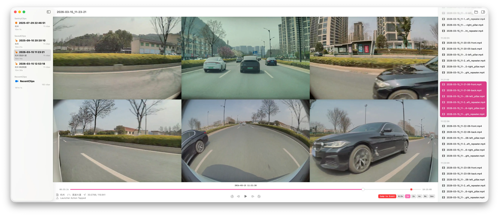
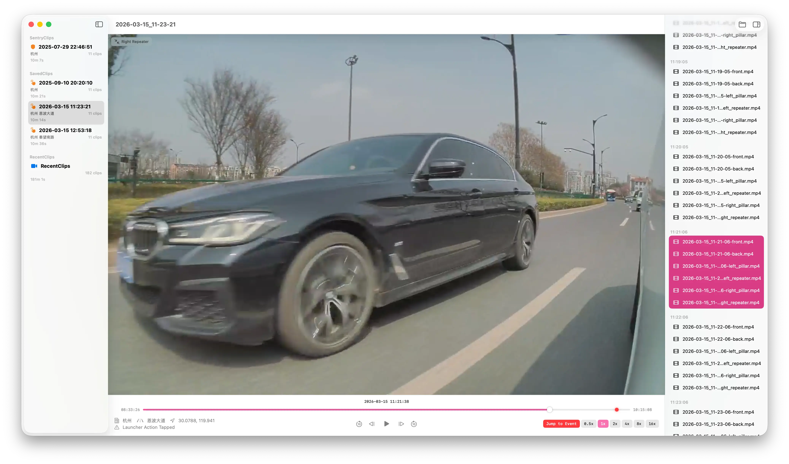

# TeslaCam Viewer

A native macOS application built with SwiftUI for viewing Tesla Dashcam and Sentry Mode videos. Watch multiple camera angles simultaneously with synchronized playback and easily navigate through your saved events.



## Features

- **Synchronized Multi-Angle Playback**: View all available camera feeds (Front, Back, Left/Right Pillars, Left/Right Repeaters) at the same time.
- **Click to Zoom a Single View**: Click any camera angle to enlarge it for a closer look.
- **Easy Import**: Open or drag & drop a `TeslaCam`, `RecentClips`, `SavedClips`, `SentryClips`, or single event folder directly into the app.
- **Event Organization**: Automatic grouping and sorting of clips with a convenient sidebar for quick navigation between events.
- **Event Inspector**: View detailed event metadata, including timestamp, location (city/street), and the reason for the recording.
- **Jump to Event**: Quickly jump to 10 seconds before the event trigger time.
- **Keyboard Shortcuts**:
  - `Space` — Play / Pause
  - `Left Arrow` / `Right Arrow` — Step backward / forward
  - `Shift` + `Left Arrow` / `Right Arrow` — Skip backward / forward by 10 seconds

### Screenshots

Click any camera view to zoom:



## Building from Source

### Prerequisites

- macOS 15.0 or later
- Xcode 16.0 or later

### Steps

1. Clone the repository:
   ```bash
   git clone https://github.com/OwlllOvO/TeslaCamViewer.git
   cd TeslaCamViewer
   ```
2. Open the project in Xcode:
   ```bash
   open TeslaCamViewer.xcodeproj
   ```
3. Select the **TeslaCamViewer** scheme and **My Mac** as the destination.
4. Press `Cmd + R` (`⌘R`) or click the **Play** button to build and run the application.

## How to Use

1. Plug your Tesla USB drive into your Mac.
2. Open **TeslaCam Viewer**.
3. Drag and drop the `TeslaCam` folder onto the app window, or click **Open Folder** to select it.
4. Select an event from the sidebar and start watching!